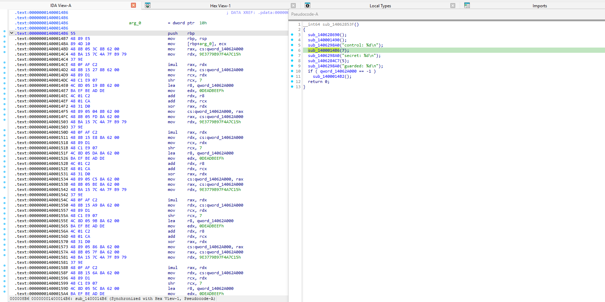
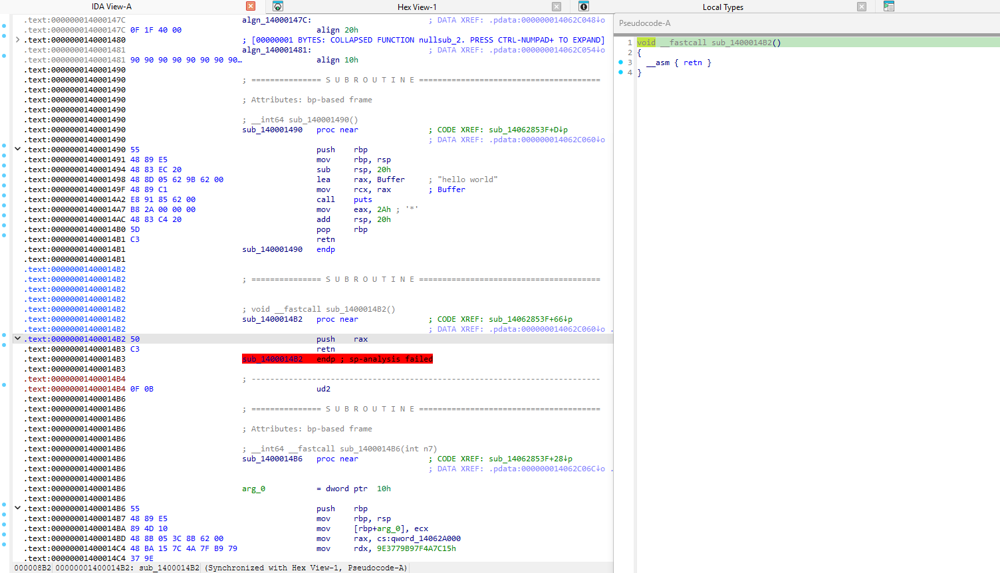
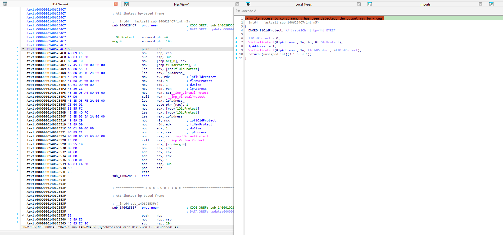

# No-Pseudocode
Three techniques to prevent Ida Pro from decompiling your code


# Refusing the Decompiler: Preventing IDA from decompiling your code

**This is the companion post to `refuse.h`, a drop in C header file that
protects individual functions from the IDA Pro decompiler.** Everything
below was measured against IDA Pro 9.3 `hexx64.dll`.

**Why I wrote this.** I don't want my code to be easy to decompile, and
most anti-decompilation advice I've found online is recycled. The same
tricks get copied around for years & are easily bypassed. I wanted to know what actually works against
the current Hex-Rays so I decided to reverse engineer it myself. What the decompiler does
stage by stage, where each stage gives up, and how little code it takes
to make that happen. Three working techniques came out of it fairly
quickly, all small enough to explain fully, all written in `refuse.h`.

One upfront note: these are the easy techniques and they fairly easy to
defeat. The stealthier methods are coming in a follow up post in the future.

Note: nothing here breaks IDA, and nothing is hidden from
it either. The disassembler keeps working and the listing stays readable.
What these macros do is make the decompiler refuse, or bluff on the
functions you protect. Hence the name `refuse.h`.

- `refuse.h`: header file that contains three macros: `REFUSE_BIG()`,
  `REFUSE_SP_THUNK()`, `REFUSE_SELFMOD()`.
- `hello_world.c`: the demo: one control function, plus one protected
  function for each method.

Build the demo:

```console
gcc -O0 -s hello_world.c -o hello_world.exe
```


# Part 1: How Hex-Rays actually decompiles a function

Part 1 is the longest for a reason. In order to break the decompiler, I had to
know exactly how it works first. This section walks every stage of
`hexx64.dll`, what each stage does & assumes, and which failure code it raises
when the assumption breaks.

## 1.0 Two different programs do the work

When you press F5 to decompile, two separate bodies of code have already
worked on your target

1. **The IDA kernel** — the disassembler — loaded the file, carved it
   into segments, resolved imports, and decided **what is a function**.
   This happens once at load time during auto-analysis.
2. **The Hex-Rays plugin**, `hexx64.dll` on x86-64, converts one
   already discovered function into microcode, optimizes it, recovers
   structure, and prints C. This happens on demand, per function, every
   time you press F5.

The important note: **the decompiler never sees bytes the kernel
didn't already turn into a function.** Thus, these two programs have different
attack surfaces. Remember that this explanation targets the decompiling portion.

## 1.1 Stage 0: loading and auto-analysis

On a PE x64 file the kernel's function list comes from several sources:

- **Flow following.** Starting from the entry point, every direct
  call/jump target becomes code. All targets become functions.
- **Symbols.** if any survive: exports, or a symbol table you forgot to
  strip.
- **Unwind metadata.** Every function in a normal Windows x64 build has
  a `RUNTIME_FUNCTION` entry in `.pdata` pointing at its begin and end,
  and the loader hands those boundaries to the analyzer.
- **Nothing else.** Code that is never called, never referenced, and not
  in unwind metadata never becomes a *function*. I measured this with a
  test binary whose unreferenced junk region holds 200,000 instructions:
  after full auto analysis, `get_func()` on the junk returns "no
  function". IDA still decodes the bytes and shows them in the listing,
  but they are not a function, and no size changes that. This is what
  "the function simply doesn't exist" actually looks like.

Two takeaways. First, hiding a function from IDA means keeping it
unreferenced and out of `.pdata`. Size alone accomplishes nothing: the
demo's own `secret_function`, all 1,228,807 instructions of it, is
discovered and fully decoded because a call and a `.pdata` entry point
at it. Second, everything the kernel produces here is just bytes and
addresses, and none of the tricks in this post touch it. Decoding has
one right answer; there is nothing to fool. The decompiler's job is
different: it has to build a *consistent story* about the bytes. A
stack frame, variables, control flow, and a memory model. Stories can be
broken. All three methods below break the story, not the decoder.

## 1.2 The decompiler pipeline

F5 runs one function through a fixed pipeline. Each stage transforms the
function's code into a more refined intermediate form, and the plugin
labels every stage with a name. It's **maturity level**. The names come
straight from the plugin and you can watch them change in the microcode
explorer, where the "Raise/Lower maturity level" commands step the view
through the stages one at a time:

```text
MMAT_ZERO → MMAT_GENERATED → MMAT_PREOPTIMIZED → MMAT_LOCOPT
        → MMAT_CALLS → MMAT_GLBOPT1 → MMAT_GLBOPT2 → MMAT_GLBOPT3
        → MMAT_LVARS → MMAT_FINAL → structural analysis → emission
```

Stage by stage:

**1. Microcode generation (`gen_microcode`) → MMAT_GENERATED.**
Each x86-64 instruction is translated into a few operations of a small
RISC-like internal language the plugin calls microcode. `m_mov`,
`m_add`, `m_xor`, `m_call`, … — operating on an idealized machine with
virtual registers and abstract stack locations instead of the real
register file. The result is an `mba_t`: an array of basic blocks
`mblock_t` of micro-instructions `minsn_t` with operands `mop_t`. Two
measured details matter for attack purposes:

- A pass called **`convert_pushes`** rewrites push/pop micro-ops into
  stack frame slots. It computes the slot offset for each push/pop and,
  when the offset lands *below the frame floor*, throws failure code
  **-5, "positive sp value has been found"**. This is the check the
  classic stack busting thunks aim at.
- A **size watchdog** runs inside generation. Per translated instruction
  it adds to a counter, and after each addition compares:

  ```asm
  ; the size watchdog, one of two identical sites in the plugin
  add     [r14+328h], rax        ; accumulate size
  mov     rax, [rbx+558h]        ; decompiler config
  mov     eax, [rax+28Ch]        ; MAX_FUNCSIZE field
  shl     eax, 0Ah               ; << 10 — that is, × 1024
  cdqe                            ; widen for the 64-bit compare
  cmp     [r14+328h], rax        ; over the wall
  jbe     ok
  mov     eax, 0FFFFFFE3h        ; -29: "too big function"
  ```

  `MAX_FUNCSIZE` is a documented setting in `cfg/hexrays.cfg`:
  `MAX_FUNCSIZE = 64  // Functions over 64K are not decompiled`. So the
  wall is **64 × 1024 = 65,536 accumulated units**. The counter sums the
  code bytes of each translated instruction, and this is the wall Method
  1 lives on. Instructions the translator can't model at all raise **-2,
  "cannot convert to microcode"** here too.

**2. Preoptimization -> MMAT_PREOPTIMIZED.** Peephole rewrites on the
fresh microcode. Constant folding, useless cast removal, jump threading.
The debug markers "before preoptimize" and "after preoptimize" are in
the binary.

**3. Local optimization -> MMAT_LOCOPT.** Per-basic-block dataflow
analysis. Use/def chains, dead code elimination, constant and register
propagation within blocks.

**4. Call analysis -> MMAT_CALLS.** Resolving call targets, prototypes,
argument locations, spoiled register sets, no return functions; variadic
calls get their format strings parsed via `PARSE_FMT_MODE` in
hexrays.cfg. Failures here are **-12, "call analysis failed"**.

**5. Global optimization, three passes -> MMAT_GLBOPT1/2/3.** Global
value numbering / CSE, cross block constant and register propagation,
global dead code elimination, branch simplification. This is where
straight line junk *would* be folded away, but note the ordering: the
64 Kb watchdog fires during stage 1 **before** any of this. So even
perfectly foldable junk still counts against the wall. Junk
made of dead register arithmetic trips -29 at the same size as volatile
junk..

**6. Local variable allocation -> MMAT_LVARS.** Surviving stack slots are
mapped to named local variables, sizes are inferred, overlaps and
partial initialization are diagnosed. The whole lvar failure family lives
here: **-9** "stack frame is too big", **-10** "local variable allocation
failed", **-19** "max recursion depth reached during lvar allocation",
**-20** "variables would overlap", **-21** "partially initialized
variable".

**7. Final microcode -> MMAT_FINAL.** Last normalizations. At this point
the microcode is **cached in the IDB**. The plugin serializes the whole
`mba_t`. Fields like `mba.blocks`, `mba.lvars`, and `mba.maturity` are
all in the binary's serialization schema, and the next F5 prints
`restored microcode from idb` instead of recomputing.

**8. Structural analysis.** The optimized block graph is pattern matched
back into C structure (`if/else`, `while/do/for`, `switch`,
`break/continue`), producing the `ctree_t`. Control flow that can't be
expressed becomes either a `JUMPOUT()` helper, when the "Use JUMPOUT()
for out-of-function jumps" option is on, or an `__asm { … }` hole in the
output. A "fast structural analysis" option trades nesting quality for
speed on huge functions. Switch idiom failures are **-7**, unwind/SEH
metadata problems are **-8**.

**9. Emission.** The ctree is pretty-printed: declarations, casts,
labels, comments. This stage *succeeds* even when the underlying model is
broken; it just attaches warning banners. Two verified ones:

```c
// write access to const memory has been detected, the output may be wrong!
// positive sp value has been detected, the output may be wrong!
```

Banners are the decompiler admitting its story might be wrong while still
telling it. This soft-failure channel is what Method 3 and the
`pop`-style thunk variants exploit.

## 1.3 The failure codes

When a stage gives up, the function that decompiles, `decompile_func`,
fills a small failure structure with a code which is a negative integer. There is a 37 entry string table
in the plugin, and one accessor that indexes it as **`table[1 - code]`**,
bounds-checked at `(1 - code) < 0x25`. Read off the binary, the complete
table on IDA 9.3 is:

| code | message | pipeline stage |
|-----:|---------|----------------|
| 0 | no error | success |
| -1 | INTERR: %s | internal |
| -2 | cannot convert to microcode | microcode gen |
| -3 | not enough memory | any |
| -4 | invalid basic block | microcode gen / blocks |
| **-5** | **positive sp value has been found** | convert_pushes, stack tracking |
| -6 | prolog analysis failed | prolog recognition |
| -7 | switch analysis failed: %s | switch analysis, jump tables |
| -8 | exception analysis failed | unwind metadata |
| -9 | stack frame is too big | frame sizing |
| -10 | local variable allocation failed | lvar allocation |
| -11 | 16-bit functions cannot be decompiled | bitness |
| -12 | call analysis failed | call analysis, MMAT_CALLS |
| -13 | function frame is wrong | frame consistency |
| -14 | undefined or illegal type '%s' | type system |
| -15 | inconsistent database information | IDB state |
| -16 | wrong basic type sizes in compiler settings | config |
| -17 | redecompilation has been requested | control flow of the plugin |
| -18 | decompilation has been cancelled | user cancel |
| -19 | max recursion depth reached during lvar allocation | lvar allocation |
| -20 | variables would overlap: %s | lvar layout |
| -21 | partially initialized variable: %s | lvar layout |
| -22 | too complex function | global optimization |
| -23 | license not available (%s) | licensing |
| -24 | only 32-bit functions can be decompiled in the current database | bitness |
| -25 | only 64-bit functions can be decompiled in the current database | bitness |
| -26 | already decompiling a function | reentrancy |
| -27 | far memory model is supported only for pc | memory model |
| -28 | special segments cannot be decompiled | segments |
| **-29** | **too big function** | size watchdog, MAX_FUNCSIZE × 1024 |
| -30 | bad input ranges | input |
| -31 | current architecture is not supported | arch |
| -32 | bad instruction in the delay slot | arch, delay slots |
| -33 | no error, stop the analysis | graceful stop |
| -34 | cloud: %s | cloud decompilation |
| -35 | emulator: %s | emulator-assisted |

Index 0 of the array holds one extra, which is a decompiler internal entry. "no
error, switch to new block". Which is why the table has 37 entries for
36 failure codes.

So a failure code tells you exactly which stage's assumptions your code
broke. The design space for anti decompilation tricks is this table.
Pick a stage, break its assumption, pay nothing at runtime.

---

# Part 2: Three easy methods

There are more ways to stop the decompiler than the three below, and
better ones. These are the cheap wins. They block pseudocode generation
only, and do **Not** touch the assembly. All three are defeatable by a
mature reverse engineer, so think of them as speed bumps, not walls.
The more mature methods will follow in later articles and repositories.

## Method 1: `REFUSE_BIG()`, over the 64 KiB wall

The decompiler refuses any function whose body crosses
`MAX_FUNCSIZE × 1024` with **-29, "too big function"**, and it refuses
*fast*, because the watchdog trips during microcode generation without
building anything. The macro drops a flood of deliberately non foldable
arithmetic against a `volatile` sink into your function:

```c
int secret_function(int seed) { REFUSE_BIG(); return seed ^ 0x5A5A5A5A; }
```

**Measured on the demo binary**, stripped `hello_world.exe`:
`secret_function` is 6,451,217 bytes of code containing **1,228,807
instructions**. Of those, 102,400 are macro-generated statements of
exactly 12 instructions each at `-O0`; the other 7 are the function's
own prologue, argument save, return, and epilogue. F5 on it fails with
`hexrays_failure_t.code = -29` in **0.98 seconds** on the test machine.
Whoever presses F5 gets a dialog and no pseudocode.

**How much junk do you actually need?** Far less than the macro emits.
The wall is at 64 KiB:

| function | size | instructions | F5 result |
|---|---:|---:|---|
| asm junk | 45,969 B | 10,001 | decompiles (7.1 s) |
| asm junk | 64,401 B | 14,001 | decompiles |
| **asm junk** | **73,601 B** | **16,001** | **-29 (0.01 s)** |
| refuse.h C junk | 63,019 B | 12,008 (1,000 stmts) | decompiles |
| **refuse.h C junk** | **94,519 B** | **18,008 (1,500 stmts)** | **-29 (0.01 s)** |
| demo `secret_function` | 6,451,217 B | 1,228,807 | **-29 (0.98 s)** |

Every ok/fail pair straddles exactly 65,536 bytes, the `MAX_FUNCSIZE=64`
check quoted in §1.2. The threshold counts accumulated code bytes, and the
watchdog adds each translated instruction's byte extent, so the exact
instruction count at the edge wobbles with the instruction mix.
The header's default, 102,400 statements and about 6.4 MB, over delivers
by roughly 100× on purpose. It stays safe if Hex-Rays raises the
default, and a "too big function" looks like a legitimate monster
function, not an attack. If bloat matters then shrinking the repetition
chain to a few thousand statements still clears the wall with margin.

**What about hiding the function from discovery entirely?** On 9.3,
size won't do it: even the demo's 1,228,807 instruction function is
discovered and fully decoded. What *does* hide code from the analyzer is
having no references and no `.pdata` entry (§1.1). Method 1 therefore
doesn't try to hide the function. It lets the function be found and lets
F5 choke on it.

**The trade-off:** this one is massive, which is what makes
Method 1 the least attractive of the three. Every protected function
grows by about 6.4 MB of junk, and the binary bloats fast once
you protect more than a couple of functions.

## Method 2: `REFUSE_SP_THUNK()`, the 2-byte stack poison

Hex-Rays tracks the stack pointer through every function. Anything that
makes the tracked stack misbehave attacks stage 1's `convert_pushes`
pass (§1.2), home of code -5. The minimal instrument is a **two-byte
thunk**:

```asm
push rax   ; 50
ret        ; C3
```

The macro defines it as a naked function at file scope:
`REFUSE_SP_THUNK(name)`. No prologue, so the body is exactly `50 C3`,
measured in the demo. GCC appends a `0F 0B` `ud2` alignment pad, so the
function occupies 4 bytes on disk. `naked` keeps the compiler's prologue
out of the body. `used` keeps the linker from discarding the function and so
it must **never be called**: `ret` pops the just-pushed `rax`, so
executing it jumps to whatever was in `rax`. Its existence is the
protection.

**Measured on IDA 9.3.** Older write ups promise a hard -5 refusal for
this shape; 9.3 is gentler. The decompiler's tail call recovery absorbs
the unbalanced stack first. Three contexts produce the same result: the
demo PE with unwind metadata, a minimal PE with `.pdata`, and a minimal
PE with no unwind metadata at all.

```c
void __fastcall sub_1400014B2()
{
  __asm { retn }
}
```

A hollow stub, `hexrays_failure_t.code = 0`, with the warning
*"unbalanced stack, ignored a potential tail call"*. Whoever opens it
gets no pseudocode and no body. The hard -5 refusal
path still exists in the plugin for shapes the recovery can't excuse,
but a 2 byte `push;ret` isn't one of them on 9.3.

Its one byte cousins on the same mechanism go a little bit further. They produce
*poisoned* output instead of a stub:

| thunk bytes | F5 result (IDA 9.3, measured) |
|---|---|
| `push rax; ret` | hollow `__asm { retn }` stub; warning "unbalanced stack, ignored a potential tail call" |
| `pop rax; ret` | banner "// positive sp value has been detected, the output may be wrong!"; warning "positive sp value 8 has been found"; body decompiles to `return v1;` where `v1` is the *undefined* slot at `[rsp-8h]` |
| `add rsp, 8; ret` | same banner and warning; body decompiles to an empty `void f() { ; }`. The `ret` vanished from the model |

**The trade-off:** the thunk must never be called, and a 2-byte function
is hand fixable.

## Method 3: `REFUSE_SELFMOD()`, the const-memory poison

The third method skips refusal entirely and attacks stage 9's emission
through the decompiler's **memory model**. Hex-Rays assumes code and
read-only data are immutable; when a function writes into them, the model
breaks and the printer says so:

```c
// write access to const memory has been detected, the output may be wrong!
```

The header implements it in ~10 instructions: `VirtualProtect` the page
containing a `const` canary writable, store one byte, flip it back.

**Measured on the demo:** `guarded_selfmod()` decompiles successfully,
`code = 0`, with the banner on top. The `lpAddress_` in the output is the
canary: a `static const` byte in `.rdata`. The stripped binary has no
name for it, so the decompiler makes one up.

```c
// write access to const memory has been detected, the output may be wrong!
__int64 __fastcall sub_1406284C7(int a1)
{
  DWORD flOldProtect; // [rsp+2Ch] [rbp-4h] BYREF

  flOldProtect = 0;
  VirtualProtect(&lpAddress_, 1u, 4u, &flOldProtect);
  lpAddress_ = 1;
  VirtualProtect(&lpAddress_, 1u, flOldProtect, &flOldProtect);
  return (unsigned int)(3 * a1 + 1);
}
```

Note that the store is right there in the output, and the decompiler
*still* flags the function as untrustworthy, because the store targets
memory its model calls const. On the separate research blob this
technique came from, a self-relocating entry region decompiled as
`memset(nullptr, 158, 0x33Bu)`, a call that does not exist in the
binary. Whoever reads the output gets something the decompiler itself
flags as unreliable. Additionally, on the blob above, something actively wrong.

One subtlety: none of this touches the disassembly. The listing shows
`lea rax, lpAddress_; mov byte ptr [rax], 1` in plain sight. It's the
decompiler's memory model that can't believe what it sees, because the
disassembler and the decompiler have different jobs (§1.1). Decoding
has one right answer, and building a consistent story about the bytes
does not. A store into a read only section breaks the story. The banner
is the decompiler admitting that.

**The trade-off:** degradation, not refusal. A reverse engineer still
gets pseudocode, but pseudocode with a warning at the top and mis-modeled
semantics around the store.

---

## What a reverse engineer sees

| Function | F5 result |
|---|---|
| `hello_world()` (control) | clean pseudocode, instantly |
| `secret_function()` (Method 1) | refusal: "too big function", `code = -29`, in 0.98 s |
| `thunk_refuses_ida()` (Method 2) | hollow `__asm { retn }` stub + "unbalanced stack" warning; no body |
| `guarded_selfmod()` (Method 3) | decompiles with the const-memory banner; store mis-modeled |

In practice:



That dialog is Method 1. The function sits in the listing, all 6.4 MB of it, but F5 won't touch it.



Method 2 "succeeds": the decompiler prints the thunk as an empty stub. The unbalanced-stack warning is the only sign anything happened.



Method 3 hands you pseudocode, but the banner at the top disowns it, and the store into the canary sits right in the output.

For context, decompiling junk *below* the Method 1 wall is legal but
unpleasant: 5,001 junk instructions took 2.1 s, 10,001 took 7.1 s. Cost
grows super-linearly until the wall makes it moot.

## So can the disassembler itself be fooled?

The three methods above attack the decompiler's pipeline; the
disassembler, stage 0, is the one thing this post never touches. That
asymmetry is not an accident. Decoding bytes has one right answer, which
makes the disassembler the hardest layer to fool. Everything downstream
has to build a *story about* the bytes, and stories can be broken.

Breaking stage 0 requires changing what the bytes *are*, not what they
mean. There are two ways to achieve this: **encryption at rest**, the bytes on disk
are not the bytes that execute. The real code only exists after a
runtime only decryption step, until then the disassembly is positively,
provably wrong. The second way is **data/code ambiguity**. Regions that are data to
the static view and code to the runtime view, or code that a linear
sweep and a control flow walker disagree about. Both require a decryption stub, overlapping byte streams, execution you can
only watch dynamically. 

How far you can push stage 0, what it costs in bytes and runtime, and
what the decompiler does with code that only materializes at execution
time. That trade is the next article.
